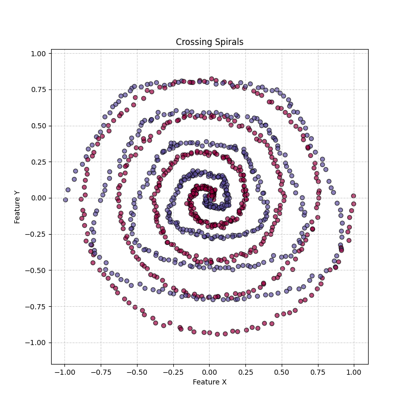
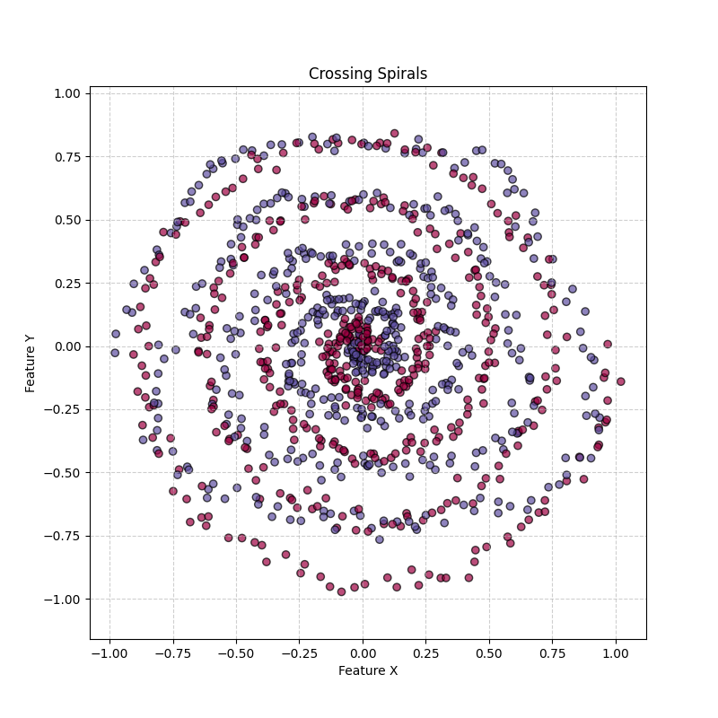

# Hard Problem - Crossing Spirals Classification
Non-linear binary classification task on complex geometric patterns.

## Problem Description
The goal is to distinguish between two interlocking spirals where one spiral follows a standard path and the second spiral follows a modulated, "wobbling" path that creates multiple intersection nodes.

| No-noise  | With-noise |
| ------------- | ------------- |
|  |  |
The two input features are:
- Feature X (Cartesian x-coordinate)
- Feature Y (Cartesian y-coordinate)

The two output classes are:
- 0 = Red Spiral
- 1 = Blue Spiral

## Dataset
The dataset is provided as `crossing_spirals_train.csv` & `crossing_spirals_test.csv`.

### Columns
- x
- y
- label

## Suggested Network Topology
- Input layer: 2 neurons
- Hidden layer 1: 32 neurons
- Hidden layer 2: 32 neurons
- Output layer: 1 neuron 

Suggested topology: **2-32-32-1**

## Task Type
Binary classification

## Suggested Activation Functions
Choose from the defined benchmark set:
- ReLU
- Leaky ReLU
- Sigmoid
- TanH
- Swish
- Identity

## Training
The number of epochs: 300